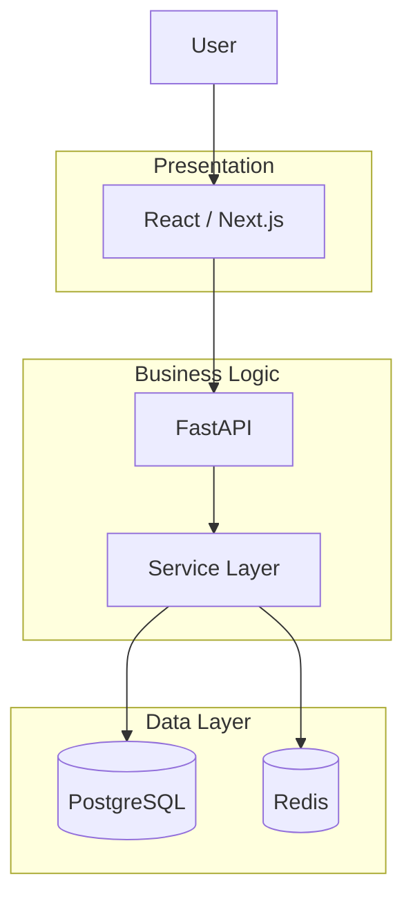

# Air Quality Prediction
This project predicts Air Quality Index (AQI) using machine learning algorithms in **Python**.

**Status:** In Progress

## Features:
- Predict AQI from environmental parameters
- Built using scikit-learn and pandas

## Tech Stack:
- Python
- Pandas
- Scikit-learn

